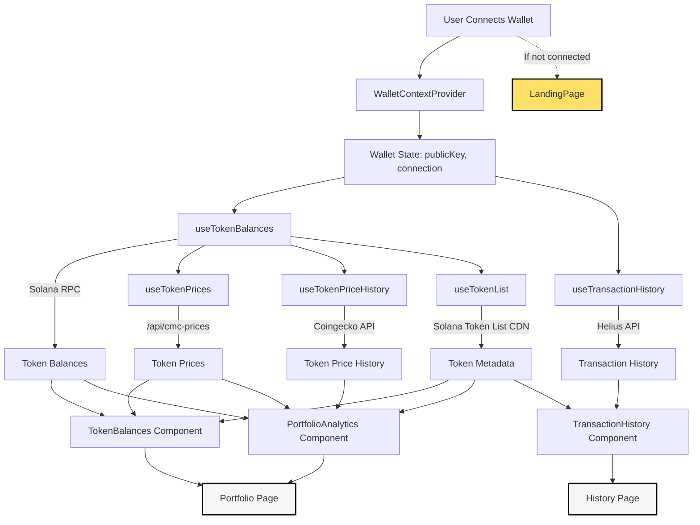

# Lumina: Brutal Crypto Portfolio Tracker

Lumina is a powerful, beautiful, and brutally honest multi-chain crypto portfolio tracker. Track your assets, view analytics, and monitor your transaction history across major blockchains—all in one place.

---

## 🚀 Features
- Unlimited wallet tracking
- Real-time price feeds
- Advanced portfolio analytics
- Multi-chain support (Solana, Bitcoin, Ethereum, Polygon, Sui, Arbitrum, and more)
- Mobile-friendly responsive design
- Smart notifications (coming soon)
- Export capabilities
- Fort Knox security: your keys, your crypto

---

## 🏗️ Project Structure

```
frontend/
  app/           # Next.js pages/routes
  components/    # Reusable React components
  hooks/         # Custom React hooks for data fetching
  pages/api/     # API routes (e.g., price fetchers)
  public/        # Static assets (images, icons)
```

---

## ⚡ Data Flow Diagram

Below is a high-level overview of how data flows through Lumina:



---

## 🧩 How It Works

1. **Wallet Connection**: User connects their wallet. The app stores wallet state (publicKey, connection) using `WalletContextProvider`.
2. **Data Fetching**: Custom hooks fetch token balances, prices, price history, and transaction history using the wallet state.
3. **Data Consumption**: Components like `TokenBalances`, `PortfolioAnalytics`, and `TransactionHistory` consume this data and render the UI.
4. **Reactive Updates**: If the wallet changes, all dependent data updates automatically.

---

## 🛠️ Setup & Development

1. **Install dependencies:**
   ```bash
   cd frontend
   npm install
   ```
2. **Set up environment variables:**
   - Create a `.env.local` file in `frontend/` with your API keys (e.g., `NEXT_PUBLIC_HELIUS_API_KEY`, `NEXT_PUBLIC_HELIUS_RPC_URL`).
3. **Run the development server:**
   ```bash
   npm run dev
   ```
4. **Open [http://localhost:3000](http://localhost:3000) in your browser.**

---

## 🤝 Contributing
Pull requests are welcome! For major changes, please open an issue first to discuss what you would like to change.

---

## 📄 License
MIT 